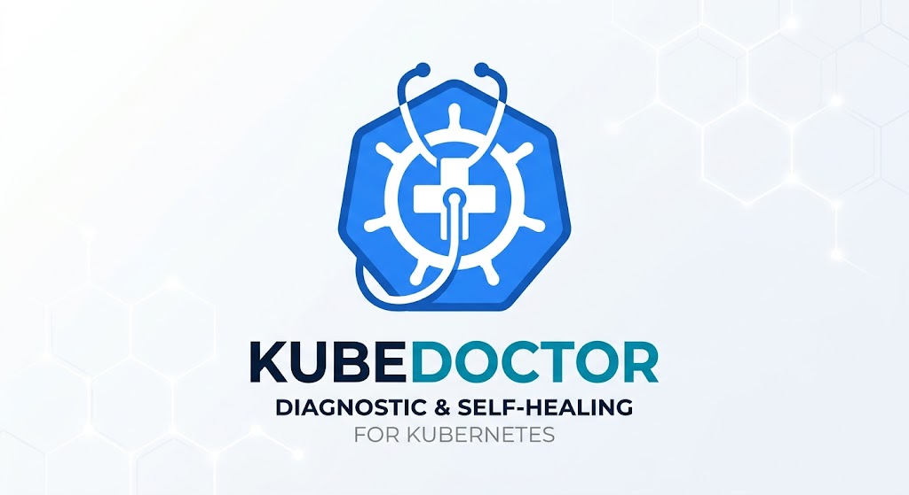

<div align="center">
  
</div>

# 🩺 KubeDoctor

**KubeDoctor** est un Opérateur de Self-Healing et de Diagnostic pour Kubernetes et OpenShift, conçu pour la production et développé en Go avec Kubebuilder / Operator SDK.

Lorsque des problèmes surviennent dans un cluster Kubernetes, analyser les logs et identifier la cause première peut être fastidieux. KubeDoctor automatise ce processus : il agit comme un architecte silencieux, surveillant votre cluster pour détecter les Pods en échec, récupérant automatiquement les logs et diagnostiquant la cause du problème. Il propose des solutions concrètes, y compris des **correctifs sous forme de patchs YAML**, pour résoudre l'incident.

Il s'intègre également parfaitement avec OpenAI (ou d'autres LLM via API) en tant que solution de secours pour analyser les erreurs non classifiées, de manière totalement configurable.

---

## 🏗️ Architecture

1. **Le Contrôleur (Manager)**
   - Surveille les événements des `corev1.Pod` à travers le cluster.
   - Se déclenche lorsqu'il détecte des états d'échec spécifiques : `CrashLoopBackOff`, `OOMKilled`, `ImagePullBackOff`, `CreateContainerConfigError`, ou des codes de sortie non nuls.
2. **Récupération des Logs & Sécurité Etcd**
   - Récupère les 50 dernières lignes de logs via un flux (stream) natif `kubernetes.Clientset`.
   - **Protection Etcd :** Tronque automatiquement les logs volumineux (> 2000 caractères) pour prévenir tout risque de dépassement de la limite de taille stricte d'Etcd (1 Mo par objet).
3. **Moteur de Remédiation Intelligent**
   - **Heuristiques Locales :** Fait correspondre les erreurs standards et génère des correctifs YAML (ex: modification des limites de mémoire).
   - **Fallback IA (Secours) :** Demande une solution générée par l'IA de votre choix. Le moteur **anonymise systématiquement** les données sensibles (IPs, Emails, Tokens) avant d'appeler l'API.
4. **Dashboard (GKE / Natif Kubernetes)**
   - Une interface utilisateur légère (Go Templates) qui affiche directement les objets `DiagnosticReport`. Parfaitement adapté pour suivre les problèmes sur GKE avant une éventuelle migration vers OpenShift.

---

## ⚙️ Configuration Exhaustive (Variables d'Environnement)

KubeDoctor et son Dashboard sont hautement configurables afin de s'intégrer à n'importe quel environnement ou fournisseur d'IA (OpenAI, Ollama, serveurs locaux compatibles OpenAI, etc.).

### Configuration de l'Opérateur (Connecteur d'IA Universel)
KubeDoctor est conçu pour être **100% agnostique** vis-à-vis du fournisseur d'Intelligence Artificielle. Il communique via le standard de facto de l'industrie (le format de requêtes OpenAI `chat/completions`).

**Vous êtes totalement autonome** : vous pouvez brancher OpenAI, Anthropic Claude, Google Gemini, Mistral, des LLMs Chinois (DeepSeek, Qwen) ou n'importe quel modèle open-source, soit directement si leur API est compatible, soit en utilisant un routeur universel gratuit comme **LiteLLM**.

Passez ces variables d'environnement au Pod de l'opérateur KubeDoctor pour le configurer selon vos désirs :

| Variable d'environnement | Description | Valeur par défaut |
| :--- | :--- | :--- |
| `LLM_API_KEY` | La clé d'API de votre fournisseur d'IA. Inutile si vous hébergez un modèle localement sans authentification. | *Vide* |
| `LLM_API_URL` | L'URL exacte du point de terminaison de l'API. C'est ce qui vous permet de pointer vers Mistral (`https://api.mistral.ai/v1/chat/completions`), un proxy LiteLLM, ou Ollama. | `http://ollama.kubedoctor-system...` |
| `LLM_MODEL` | Le nom du modèle que l'IA doit exécuter (ex: `gpt-4o`, `claude-3-opus-20240229`, `mistral-large-latest`, `llama3`). | `llama3` |

### 🤖 Option 1 : Utilisation d'une IA 100% Gratuite et Locale (Ollama)
KubeDoctor est configuré **par défaut** pour requêter une instance locale d'Ollama (sans clé d'API) afin de garantir la confidentialité absolue de vos données et éviter les coûts liés à OpenAI.

Pour déployer Ollama directement dans votre cluster à côté de l'opérateur KubeDoctor, appliquez le manifest fourni :

```bash
kubectl apply -f config/ollama/ollama.yaml
```

*Note: Une fois Ollama démarré, vous devez télécharger le modèle (ex: `llama3`) dans son conteneur:*
```bash
kubectl exec -it -n kubedoctor-system deployment/ollama -- ollama pull llama3
```
Après cela, l'opérateur interrogera automatiquement ce service gratuit en cas d'erreur inconnue !

### 🤖 Option 2 : Utilisation d'autres fournisseurs (Claude, Gemini, OpenAI, etc.)
Si vous souhaitez utiliser l'API officielle d'OpenAI, définissez :
* `LLM_API_KEY="sk-..."`
* `LLM_API_URL="https://api.openai.com/v1/chat/completions"`
* `LLM_MODEL="gpt-4o"`

Pour connecter **n'importe quel autre modèle** (Claude, Gemini, etc.) n'utilisant pas le même standard de requête HTTP qu'OpenAI, nous vous recommandons de déployer le conteneur gratuit **[LiteLLM](https://github.com/BerriAI/litellm)** dans votre cluster. LiteLLM agira comme un traducteur universel. Il vous suffira alors de faire pointer `LLM_API_URL` vers votre proxy LiteLLM !

### Configuration du Dashboard (Interface Utilisateur)
Passez ces variables d'environnement au conteneur hébergeant l'interface web.

| Variable d'environnement | Description | Valeur par défaut |
| :--- | :--- | :--- |
| `DASHBOARD_PORT` | Le port d'écoute du serveur web Go. | `8082` |
| `DASHBOARD_TITLE` | Le titre principal affiché en haut de la page et dans l'onglet du navigateur. | `KubeDoctor Dashboard` |
| `DASHBOARD_REFRESH_RATE_SECONDS` | Fréquence (en secondes) d'auto-actualisation de la page HTML. Laissez vide pour désactiver le rafraîchissement automatique. | `30` |

---

## 📈 Métriques Prometheus Customisées

KubeDoctor expose nativement des métriques au format Prometheus afin de faciliter la création de tableaux de bord Grafana.

* **Métrique disponible :** `kubedoctor_errors_detected_total` (Type: Counter)
* **Labels :** `reason` (La raison de l'erreur, ex: `OOMKilled`, `CrashLoopBackOff`)

*Exemple de requête PromQL pour l'alerte:*
`sum by (reason) (rate(kubedoctor_errors_detected_total[5m]))`

---

## 🚀 Installation & Déploiement (GKE & Vanilla K8s)

**Note Importante :** Pour des clusters Kubernetes natifs comme Google Kubernetes Engine (GKE), OperatorHub (OLM) n'est **pas** requis. Vous pouvez installer l'opérateur de manière classique.

### 1. Prérequis
- **Cluster Kubernetes**
- **kubectl**
- **Go 1.21+** et **Operator SDK** (v1.34+) en local pour la compilation.

### 2. Déploiement standard (GKE)

Compilez l'image, poussez-la sur votre registre (Google Artifact Registry, DockerHub, etc.), et déployez l'opérateur en une commande :

```bash
# 1. Compiler et pousser l'image Docker
make docker-build docker-push IMG=gcr.io/<VOTRE_PROJET_GCP>/kubedoctor:v0.1.0

# 2. Déployer les CRD et l'Opérateur sur le cluster
make deploy IMG=gcr.io/<VOTRE_PROJET_GCP>/kubedoctor:v0.1.0
```

*(Cette commande déploie automatiquement le contrôleur dans un namespace dédié et applique la Custom Resource `DiagnosticReport`.)*

### 3. Lancer le Dashboard
Pour exposer le tableau de bord web :
```bash
go build -o bin/dashboard dashboard/main.go
./bin/dashboard
```
Vous pourrez ensuite y accéder sur `http://localhost:8082` (ou via le port défini par `DASHBOARD_PORT`).

---

## 🧠 Détails du Moteur de Remédiation (Heuristiques Locales)

Même sans aucune clé d'API LLM configurée, KubeDoctor diagnostiquera :

* **OOMKilled (Code 137)** : Propose un patch YAML pour ajuster les *Limits* / *Requests* de mémoire du conteneur.
* **Java OutOfMemoryError (Heap)** : Différencie le crash applicatif du crash conteneur et propose un ajustement de `-Xmx` via `JAVA_OPTS`.
* **ImagePullBackOff** : Propose d'ajouter un *imagePullSecrets*.
* **Permission Denied** : Détecte les erreurs de droits système et propose un correctif complet de `securityContext` (`fsGroup` / `runAsUser`).
* **No Space Left on Device** : Propose l'encadrement strict par la ressource `ephemeral-storage`.
* **Exec Format Error** : Détecte les problèmes d'architecture croisée (ex: image ARM sur noeud AMD64) et propose un `nodeSelector` adapté.
* **Exit Code 143 (SIGTERM)** : Indique que le Graceful Shutdown a échoué et propose d'augmenter le `terminationGracePeriodSeconds`.
* **RunContainerError / StartError** : Indique un problème lié au point d'entrée (`command` ou `args`) ou aux permissions du script Entrypoint.
* **Connection Refused & DNS Timeouts** : Conseille sur les *NetworkPolicies*, CoreDNS, et les ports des *Services*.
* **CreateContainerConfigError** : Détecte les *ConfigMaps* ou *Secrets* manquants dans le namespace.

---

## 🛠️ Génération du Bundle OLM (OpenShift / OperatorHub)

Puisqu'une migration vers OpenShift est souvent prévue en entreprise, KubeDoctor est prêt pour être packagé en tant que Bundle OLM (Operator Lifecycle Manager).

```bash
make bundle
```
Ceci génère un ClusterServiceVersion (CSV) dans `bundle/manifests/`, rendant l'application publiable sur n'importe quel OperatorHub.

---

## 🛡️ Sécurité & RBAC
L'opérateur fonctionne selon le principe du moindre privilège, mais nécessite un accès en lecture sur les logs :
- `pods` (get, list, watch)
- `pods/log` (get)
- `diagnosticreports` (get, list, watch, create, update, patch, delete)
- `diagnosticreports/status` (get, update, patch)